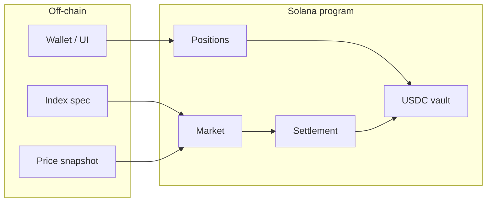

# LLM Token Futures (v1)

Cash-settled futures on **Anthropic Claude Opus 4.7 output token list price** (USD per 1 million output tokens). Built on Solana. This document describes the **11 system atoms** for v1. No program code yet.

---

## What you are building (plain language)

A **future** is a bet on a **price at a future date**, settled in **cash** (USDC), not by delivering API tokens.

- **Long** — you profit if the settlement price is **higher** than the price when you opened.
- **Short** — you profit if the settlement price is **lower** than when you opened.

**Underlying (v1):** Anthropic’s published **output** price for Opus 4.7 — e.g. $25.00 per 1 million output tokens. We do **not** use input-token price in v1.

**Index:** The number we settle against. For v1 it is that **official list price** at expiry, defined in a written spec (not a live Anthropic API — they do not publish one).

**Oracle:** A trusted party (or small multisig) that reads the pricing page at expiry and posts **one** settlement number on-chain.

**Smart contract:** Holds USDC margin, records who is long/short, and at expiry moves USDC from losers to winners using the oracle price.

---

## v1 simplicity rules

When two designs are possible, v1 picks the simpler one:

| Topic | v1 choice |
|-------|-----------|
| Underlying | Output tokens only |
| Settlement | Cash (USDC) only |
| Trading | Open positions until cutoff; **hold to expiry** (no early close) |
| Position | **One position per user per market** (long or short, size in contracts) |
| Margin | **Fixed USDC per contract** at open (enough to cover max loss) |
| Order book | None — users open directly against the program |
| Oracle | **Permissioned** signers post one settlement price |
| Markets | One expiring market at a time (e.g. monthly) is enough to start |

---

## System overview

---

## The 11 system atoms

Each atom is a piece you can define, build, or test on its own.

### 1. Index definition

**What it is:** The rulebook for the number we settle on.

**Includes:**

- Underlying: Opus 4.7 **output** USD per **1 million tokens**
- Model ID: e.g. `claude-opus-4-7` (exact string in spec)
- Source: Anthropic pricing documentation / pricing page (named URL in spec)
- Observation: price valid at **expiry time** (UTC defined per market)
- Exclusions (v1): no batch discount, prompt cache, or regional premium — **base list output price only**
- Storage: short human-readable spec + **hash** stored on the market at creation

**Not a running service** — a document everyone agrees on before the market opens.

---

### 2. Market configuration

**What it is:** One on-chain **Market** account = one futures contract (e.g. “April 2026 Opus 4.7 output”).

**Includes:**

- Schedule: `open`, `trade_cutoff`, `expiry`, `settlement_window_end`
- Economics: contracts size (e.g. 1 contract = exposure to 1 MTok of index), fees (optional, can be 0 in v1)
- Margin: fixed USDC required per contract
- Lifecycle: `Open` → `TradingHalted` → `Settled` → `Finalized`
- Index spec hash (from atom 1)
- Settlement price field (empty until oracle posts)

**Created once** per expiry period.

---

### 3. Collateral vault

**What it is:** A program-controlled USDC account (SPL token) for one market.

**Does:**

- Receives USDC when users open positions
- Pays USDC to users after settlement and withdraw
- Must always have enough USDC to cover all obligations (enforced by margin rules at open)

**Atomic action:** transfer USDC in or out, tied to a user’s position or withdrawable balance.

---

### 4. Position ledger

**What it is:** Per-user record of exposure in one market.

**v1 shape (simplest):**

- One account per **(market, user)**
- Fields: side (long / short), number of contracts, **entry price** \(F_0\), locked margin, status
- No adding to size after open in v1 (optional later: “increase” — skip for now)

**Lifecycle:**

1. **Open** — lock margin, record \(F_0\) and contracts  
2. **Settle** — at expiry, apply formula, clear position, credit user’s withdrawable balance  
3. **Withdraw** — user pulls USDC after market is finalized  

No “close early” in v1.

---

### 5. Program instructions

**What it is:** The allowed actions users (and keepers) send to Solana.

**v1 set:**

| Instruction | Purpose |
|-------------|---------|
| `initialize_market` | Create market + vault + config |
| `open_position` | Long or short; deposit margin |
| `halt_trading` | After cutoff, block new opens (anyone can call when time passed) |
| `post_settlement_price` | Oracle writes \(F_T\) |
| `settle_market` | Compute all PnL, update balances |
| `withdraw` | User takes USDC after finalized |

Each instruction = **one** state change with clear checks (time, status, signatures).

---

### 6. Settlement engine

**What it is:** Pure math inside the program at expiry.

**Per long position:**

\[
\text{PnL} = \text{contracts} \times (F_T - F_0) \times \text{contract\_size\_scale}
\]

Short = opposite sign. Fees subtract if enabled.

**v1 safety:** require enough margin at **open** so worst-case loss (price → 0 for long, or very high for short) cannot drain the vault. Simplest bound: margin ≥ contracts × \(F_0\) for shorts and margin ≥ contracts × (max_price_cap − \(F_0\)) for longs, or cap max index move in the oracle rules.

**Prices on-chain:** integers in **micro-dollars per MTok** (e.g. $25.00 → `25_000_000`).

Deterministic: same \(F_T\) and positions → same payouts.

---

### 7. Oracle snapshot (off-chain)

**What it is:** Tooling run at expiry to produce the settlement number and proof.

**Steps:**

1. Fetch Anthropic pricing source at expiry  
2. Parse **Opus 4.7 output** $/MTok  
3. Convert to micro-dollars  
4. Save canonical snapshot (JSON) + hash (evidence for disputes)

**Output package:** `{ price, market_id, expiry, spec_hash, evidence_hash }`

---

### 8. Oracle post and validate (on-chain + keeper)

**What it is:** Getting \(F_T\) onto the chain safely.

**On-chain:**

- Allowlisted oracle pubkeys (multisig in v1)  
- `post_settlement_price` only after `expiry`, only once per market  
- Optional: price within min/max band vs entry prices  

**Off-chain:**

- Keeper submits the transaction after snapshot is ready  

Separate steps: **post price** → then **settle_market**.

---

### 9. Time and lifecycle controller

**What it is:** Rules that depend on the clock.

| When | What happens |
|------|----------------|
| Before `open` | Nothing allowed |
| `open` … `trade_cutoff` | `open_position` allowed |
| After `trade_cutoff` | New positions rejected (`halt_trading`) |
| After `expiry` | Oracle may post price |
| After price posted | `settle_market` |
| After settlement | Users `withdraw` |

Anyone can call time-based cranks when conditions are met (simplest ops).

---

### 10. Client / wallet layer

**What it is:** App or script that talks to Solana.

**Does:**

- Show market dates, margin per contract, index spec link  
- Build transactions: open, withdraw  
- Show position: side, contracts, entry price, locked margin  
- Does **not** replace on-chain checks — mirrors program rules for UX only  

---

### 11. Operations and governance

**What it is:** Humans and keys around the code.

**Includes:**

- Deploy new market each period  
- Manage oracle allowlist  
- Playbook if Anthropic changes page layout or model name  
- Program upgrade authority (or freeze program for immutable v1)  

---

## What v1 explicitly does not include

- Order book or matching engine  
- Mark-to-market and liquidation  
- Input-token or blended index  
- Live Anthropic API as oracle  
- Early exit before expiry  
- Delivery of API credits or tokens  

---

## Build order (suggested)

1. Index spec (atom 1)  
2. Settlement math tests off-chain (atom 6)  
3. On-chain accounts + open / settle / withdraw (atoms 2–5)  
4. Oracle post + snapshot tool (atoms 7–8)  
5. UI (atom 10)  
6. Ops runbook (atom 11)  

---

## Testing before any on-chain code

Testing is layered: prove the **math and rules** first (cheap), then the **program** on a local validator (no real money).

### Layer 1 — Settlement math (off-chain, first)

Spreadsheet or small scripts (TypeScript/Rust/Python):

- Long wins: \(F_T > F_0\)  
- Short wins: \(F_T < F_0\)  
- Flat: \(F_T = F_0\)  
- Many contracts, integer rounding, fees = 0 and fees > 0  
- **Vault solvency:** sum of all payouts + remaining margin = total USDC deposited  

These tests do not need Solana. They catch formula bugs early.

### Layer 2 — Rule and state machine (off-chain)

Table of “given market status + time + action → accept or reject”:

- Open before `open` → reject  
- Open after cutoff → reject  
- Post price before expiry → reject  
- Post price twice → reject  
- Settle without price → reject  
- Withdraw before finalized → reject  

Can be a simple test harness that mirrors program logic before it exists on-chain.

### Layer 3 — Oracle snapshot (off-chain)

- Fixture files: fake HTML/JSON snippets of pricing page  
- Parser returns correct micro-dollars for Opus 4.7 output row  
- Wrong model row → fail  
- Evidence hash stable for same input  

### Layer 4 — Solana program tests (local validator)

After the program exists, use **Anchor (or similar) tests** on a **local** chain:

1. Initialize market  
2. User A opens long, User B opens short (same \(F_0\))  
3. Warp time or set clocks in test to cutoff → halt  
4. Oracle posts \(F_T\)  
5. Settle → check vault and user balances  
6. Withdraw → USDC balances match expectations  

Use **fake USDC mint** in tests. No devnet required for daily development.

### Layer 5 — Adversarial / edge cases (program tests)

- Double settle, double post price  
- Open with insufficient margin  
- Open after halt  
- Integer overflow boundaries on contracts and prices  
- Short and long sizes imbalanced but vault still solvent (margin design)  

### Layer 6 — End-to-end dry run (devnet, later)

Optional before mainnet:

- Deploy to devnet, real wallet flows, oracle multisig posts test price  
- One friendly long and one friendly short through full lifecycle  

### Layer 7 — What you are not testing in v1

- Anthropic API (there is no price endpoint)  
- High-frequency trading or matching  
- Mainnet economic risk until math + program tests pass  

**Order of work:** Layer 1 → 2 → 3 in parallel with spec writing; Layer 4–5 when code exists; Layer 6 when you are confident.

---

## Glossary

| Term | Meaning |
|------|---------|
| **MTok** | One million tokens |
| **\(F_0\)** | Entry index price when position opens |
| **\(F_T\)** | Settlement index price at expiry |
| **Contract** | Unit of exposure (defined size, e.g. 1 MTok) |
| **Margin** | USDC locked to back your position |
| **Cash-settled** | Only USDC changes hands at expiry |
| **Oracle** | Source of \(F_T\) on-chain (v1: permissioned posters) |
| **PDA** | Program-derived address; Solana account owned by the program |

---

## Reference (external)

- [Anthropic pricing docs (markdown)](https://platform.claude.com/docs/en/about-claude/pricing.md) — oracle source for index (no public price API)
- Opus 4.7 output (as of doc date): **$25 / MTok** — verify at deploy time
